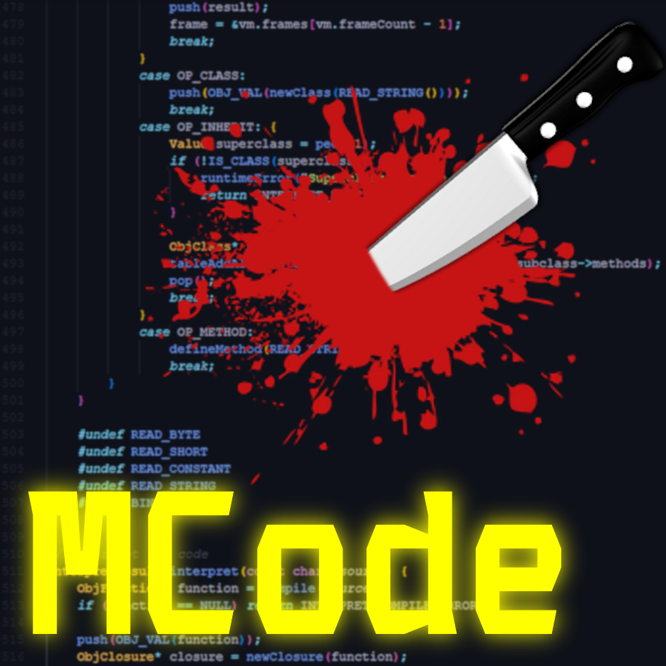

# Murder Code (N++ Code Editor)

Credits to Liam Vickers for making Murder Drones a thing so I can make this.

btw, it's a little slow =/

## How to use (Cascade)

### File cascade

Press File:New to make a new file

Press File:Open Folder to open a folder

Press File:Save to save a file. If the file dosen't have a directory it does File:Save As

Press File:Save As to save a file with a certain directory

Press File:Exit to exit

### Mode cascade

Press Mode:Dark to go to dark mode (default

Press Mode:Dark Contrast to go to dark contrast mode

Press Mode:Light to go to light mode

Press Mode:Light Contrast to go to light contrast mode

If you change one of the settings (like light to dark) it saves it so you don't have to do the same thing again

### Font cascade

Press Font:Small for small font size

Press Font:Medium for medium font size (default)

Press Font:Large for large font size

Press Font:Extra Large for extra large font size

If you change one of the settings (like med to small) it saves it so you don't have to do the same thing again

### Music cascade (play background music)

Press Music:Play to start playing background music (When audio is paused and you press play, it continues from where you left off)

Press Music:Pause to pause the music

Press Music:Restart to restart the music (Music goes on repeat by default)

Note: When pressing pause it saves your timestamp, but when closing the editor it does not so press Pause before closing to save your timestamp.

## How to use (other stuff)

### File explorer

Click on a file to open it.

If something has a + or - symbol in a box, then it is a folder. Click on it to toggle open/closed and plus/minus.
